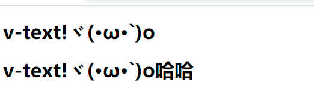

# 第一章：Vue基础

Vue3官方文档：https://cn.vuejs.org/guide/introduction.html

Vue2官方文档：https://v2.cn.vuejs.org/v2/guide/

## 1、Vue简介

**有一个核心观念要记住，vue不操作dom元素而是页面会根据数据自动发生变化，所以要改变页面元素只需要改变数据即可。**

+ JavaScript框架
+ 简化Demo操作
+ 响应式数据驱动

## 2、第一个Vue程序

+ 导入vue.js
+ 创建vue实例对象，设置el属性和data属性
+ 使用简洁的模板语法将数据渲染到页面上

```html
<!DOCTYPE html>
<html lang="en">
<head>...</head>
<body>
    <!-- 页面元素，{{}}为模板语法-->
    <div id="app">
        {{message}}
    </div>

    <!-- 开发环境版本，包含了有帮助的命令行警告 -->
    <script src="https://cdn.jsdelivr.net/npm/vue@2/dist/vue.js"></script>
    <script>
        <!-- 创建Vue实例，el-->
        let app = new Vue({
            el:"#app", <!-- 挂载点即 目标元素-->
            data:{
                message:"Hello Vue!"
            }
        });
    </script>
</body>
</html>
```

## 3、el:挂载点

通过css选择器选择元素，推荐使用id选择器。

+ **Vue实例的作用范围是什么？**

  由例子可以看出，vue实例的作用范围为：<font color='red'>el挂载点命中的元素及其子孙元素</font>

  > ```html
  > <body>
  >     {{message}}
  >     <div id="app">  
  >         {{message}}  {{message}} {{message}} 
  >         <span>hello: {{message}}</span>
  >     </div>
  >     {{message}}
  >     <script src="https://cdn.jsdelivr.net/npm/vue@2/dist/vue.js"></script>
  >     <script>
  >         new Vue({
  >             el: "#app",
  >             data: {
  >                 message: "你好"
  >             }
  >         });
  >     </script>
  > </body>
  > ```
  >
  > 

+ **是否可以使用其他选择器？**

  <font color='red'>可以：id选择器(#)，标签选择器(tag)，class选择器(.)都可以使用。【推荐使用id选择器】</font>

+ **是否可以设置其他的dom元素？**

  <font color='red'>可以，但是仅支持body内部的双标签，不支持单标签（不包含body标签和html）</font>

  > `vue.js:5076 [Vue warn]: Do not mount Vue to <html> or <body> - mount to normal elements instead.`

## 4、data:数据对象

元素中{{message}}对应vue中的data数据对象，里面的的message属性就会被data数据对象的同名属性代替

**data:数据对象支持所有的数据类型包括：数字，字符串，布尔，对象，数组等等，且数组和对象的取值方法和java一样**

> ```java
> <body>
> 
>     <div id="app">
>         {{message}} 
>         <h2>{{arr[1]}}</h2>
>         <h2>{{school.name}}</h2>
>     </div>
>     <script src="https://cdn.jsdelivr.net/npm/vue@2/dist/vue.js"></script>
>     <script>
>         new Vue({
>             el: "#app",
>             data: {
>                 message: "你好！",
>                 arr: [1,2.0,"3",true],
>                 school: {
>                     name: "小黑",
>                     mobile: 123456
>                 }
> 
>             }
>         });
>     </script>
> </body>
> ```
>
> 

# 第二章：本地应用

vue不同于其他框架是基于dom操作页面元素，vue中使用一系列v-开头的特殊语法去操作页面，而这些v-开头的特殊语法通称为：**vue指令**

所有指令的中间`v-xx:xxx=""`，双引号中间以及`{{}}`中间可以写表达式：

```html
{{age<18}}  <!-- 页面就会输出true-->
 
```

## 1、内容绑定+事件绑定

+ ***`v-text`指令*** ：设置标签的文本值（注意是全部替换了）

+ ***{{xxx}}*** ：设置标签的文本值，差值替换

  > ```html
  > <body>
  > 
  >     <div id="app">
  >         <!-- 全部替换，可直接字符串拼接 类似于themeleaf的${}-->
  >         <h1 v-text="message + '!' + info">哈哈</h1>
  >         <!--差值替换，可以进行字符串拼接(不是data域中的数据必须加上引号，否则会报错)，类似thymeleaf的[[]]-->
  >         <h1>{{message + '!' + info}}哈哈</h1>
  >     </div>
  >     <script src="https://cdn.jsdelivr.net/npm/vue@2/dist/vue.js"></script>
  >     <script>
  >         new Vue({
  >             el: "#app",
  >             data: {
  >                 message: "v-text",
  >                 info: "ヾ(•ω•`)o"
  >             }
  >         });
  >     </script>
  > </body>
  > ```
  >
  > 

+ ***`v-html`指令*** ：设置标签innerhtml 【这就说明会作为子元素存在】

  > ```html
  > <body>
  > 
  >     <div id="app">
  >         <p v-html="message"></p>
  >         <!-- v-html 可以将字符串解析成html，作为所属标签的子标签 -->
  >         <p v-html="info"></p>
  >     </div>
  >     <script src="https://cdn.jsdelivr.net/npm/vue@2/dist/vue.js"></script>
  >     <script>
  >         new Vue({
  >             el: "#app",
  >             data: {
  >                 message: "hello world!",
  >                 info: "嘻嘻<a href='#'>hello world!</a>"
  >             }
  >         });
  >     </script>
  > </body>
  > ```
  >
  > 

+ ***`v-on`指令*** ：为元素绑定事件

  <font color='red'>`v-on:事件='methodName'`可缩写成`@事件="方法名"`，且绑定的方法必须放在methods域中与el和data域同级别！</font>

  **[vue支持的所有事件：见连接](vue中v-on支持的事件总结.pdf)**

  > ```html
  > <body>
  >     <div id="app">
  >         <!-- v-on:事件="方法名" -->
  >         <input type="button" value="v-on指令" v-on:click="hello"> <br>
  >         <!-- 上面可缩写为：@click=hello" --> 
  >         <input type="button" value="v-on指令缩写" v-on:click="hello"> <br>
  >         <input type="button" value="双击" v-on:dblclick="hello">  <br>
  >         <!-- vue中改变数据 (VUE是数据驱动页面，数据变了页面会自动变化) -->
  >         <input type="button" value="点击改变页面数据" v-on:click="changeFood"> {{food}}
  > 
  >     </div>
  >     <script src="https://cdn.jsdelivr.net/npm/vue@2/dist/vue.js"></script>
  >     <script>
  >         new Vue({
  >             el: "#app",
  >             data: {
  >                 food:"西兰花炒蛋"
  >             },
  >             // 由此可以看出方法放在methods域中，数据放在data域中
  >             methods:{
  >                 hello:function(){alert("hello ")},
  >                 changeFood:function() {
  >                     //在vue中通过this得到所有属性
  >                     console.log(this.food);
  >                     this.food = "番茄炒蛋";
  >                 }
  >             }
  >         });
  >     </script>
  > </body>
  > ```

## 2、显示切换+属性绑定

+ ***`v-show`指令*** ：根据条件让元素显示或者隐藏 **频繁操作的推荐**

  > 原理就是给元素添加dispaly属性，即源代码还会有此代码
  >
  > ```html
  > 
  > ```

+ ***`v-if`指令*** ：根据表达式真假，切换元素的显示和隐藏（操纵dom元素）

  > 原来就是利用dom元素进行删除
  >
  > ```html
  > <p v-if="false">我是一个p标签</p>
  > ```

+ ***`v-bind`指令*** ：设置元素的属性

  > 格式：**v-bind:属性名="表达式"，可以简写为 :属性名="表达式"，即v-bind可以省略**
  >
  > ```html
  > <body>
  >     <div id="app">
  >          <br>
  >         <!-- 正常的三元表达式 -->
  >          <br>
  >         <!-- 对象形式的三元表达式 {active:isActive}表示active这个类名是否生效取决于isActive的值是否为真 -->
  >         
  > 
  >     </div> 
  >     <script src="https://cdn.jsdelivr.net/npm/vue@2/dist/vue.js"></script>
  >     <script>
  >         new Vue({
  >             el:"#app",
  >             data:{
  >                 imgSrc:"../Note/img/image-20220923154209018.png",
  >                 imgTitle:"hello",
  >                 isActive:false
  >             },
  >             methods:{
  >                 toggleActive:function(){
  >                     console.log(this.isActive);
  >                     this.isActive=!this.isActive;
  >                 }
  >             }
  >         });
  >     </script>
  > </body>
  > ```
  >
  > 

  **练习：图片切换**

  ```html
  <body>
      <h1>使用v-bind、v-on、v-show来实现图片的轮播功能</h1> <br>
      <div id="app">
          <!-- 左箭头-->
          <button @click="pre" v-show="index > 0">&lt;</button>
          
           <!-- 右箭头-->
          <button @click="next" v-show="index < imgArr.length -1">&gt;</button>
      </div>
      <script src="https://cdn.jsdelivr.net/npm/vue@2/dist/vue.js"></script>
      <script>
          new Vue({
              el:"#app",
              data:{
                  imgArr:["image-20220923144542967","image-20220923150433411","image-20220923154209018","image-20220923155216178"],
                  index:0
                  
              },
              methods:{
                  pre:function(){
                      if(this.index > 0){
                          this.index--;
                      }
                  },
                  next:function(){
                      if(this.index < this.imgArr.length - 1){
                          this.index++;
                      }
                  }
              }
          });
      </script>
  </body>
  ```

  效果：

  


## 3、列表循环+表单元素绑定

+ ***`v-for`指令*** ：根据数据生成列表结构

  > 语法：和thymeleaf的很相似 <font color='red'>li标签除动态的内容，其余的包括子元素全部会重复迭代复制</font>
  >
  > 

+ ***`v-on`指令补充*** ：函数传递自定义参数 + **[事件修饰符(如键盘按键，鼠标点击)](vue中v-on支持的事件总结.pdf)**

  > 官方文档定义的**事件修饰符：**
  >
  > 

+ ***`v-model`指令*** ：获取和设置表单元素用户输入的value值(**双向数据绑定**)

  > 

***联系：记事本***

```html
<body>
    记事本 <br>
    <div id="app">
        <!-- 回车新增元素-->
        <input type="text" v-model="noteCurrent" @keyup.enter="add"> <br>
        <table>
            <tr v-for="(note,index) in noteArr" >
                <td>
                    <input type="text"  :value="index+1 + ' - ' + note" disabled>  <button @click="del(index)">x</button>
                </td>
            </tr>
            <tr v-show="noteArr.length>0">
                <td>
                    {{noteArr.length}} items left 
                    &nbsp;&nbsp;&nbsp;&nbsp;&nbsp;&nbsp;&nbsp;&nbsp;&nbsp;&nbsp;&nbsp;&nbsp;&nbsp;
                    <button @click="clear">clear</button>
                </td>
            </tr>
        </table>
    </div>
    <script src="https://cdn.jsdelivr.net/npm/vue@2/dist/vue.js"></script>
    <script>
        new Vue({
            el:"#app",
            data:{
                noteArr:["吃饭饭","睡觉觉","洗手手"],
                noteCurrent:""
            },
            methods:{
                <!-- 删除单个元素-->
                del:function(index){
                    <!-- 根据元素位置删除元素-->
                    this.noteArr.splice(index,1);
                },
                <!-- 增加元素-->
                add:function(){ 
                    if(this.noteCurrent.length > 0) {
                        this.noteArr.push(this.noteCurrent);
                    }
                },
                <!-- 清空-->
                clear:function(){
                    this.noteArr=[];//记住是空数组哦
                }
            }
        });
    </script>
</body>
```


# 第三章：网络应用

将网络请求库axios和vue相结合

## 1、axios

官方：https://github.com/axios/axios

```html
<script src="https://unpkg.com/axios/dist/axios.min.js"></script>
```
<font color='red'>第一个回调函数（回参response）会在请求响应完成后触发，第二个回调函数（回参err）会在请求响应失败后触发</font>

+ **`axios.get("地址?参数").then(function(response){},function(err){})` **
+ **`axios.post("地址",{k:v}).then(function(response){},function(err){})` **

> 测试接口库：
>
> ```java
> /*
>     接口1:https://api.apiopen.top/api/sentences
> */
> 
>  /*
>      接口2:用户注册
>      请求地址:https://autumnfish.cn/api/user/reg
>      请求方法:post
>      请求参数:username(用户名,字符串)
>      响应内容:注册成功或失败
>  */
> ```

## 2、axios结合vue

```html
<body>

    <!-- 随机古诗 -->
    <div id="app">
        <h1>{{content}}</h1>
        <h1>-- {{author}}</h1>
        <button @click="getOne">换一个</button>
    </div>
     <!-- 官网提供的 axios 在线地址 -->
     <script src="https://unpkg.com/axios/dist/axios.min.js"></script>
     <script src="https://cdn.jsdelivr.net/npm/vue@2/dist/vue.js"></script>
     <script>
        let app = new Vue({
            el:"#app",
            data:{
                content:"不如子之衣，安且吉兮。",
                author:"佚名《无衣》"
            },
            methods:{
                getOne:function(){
                    let vueThis = this;
                    axios.get("https://api.apiopen.top/api/sentences").then(
                        function(response){
                            //在axios中this就不是vue了，所以需要在外面先保存vue的this
                            vueThis.content=response.data.result.name;
                            vueThis.author=response.data.result.from
                        },
                        function(err){
                            console.log(err);
                        }
                    );
                }
            }
        });
     </script>
</body>
```


# 第四章：综合应用